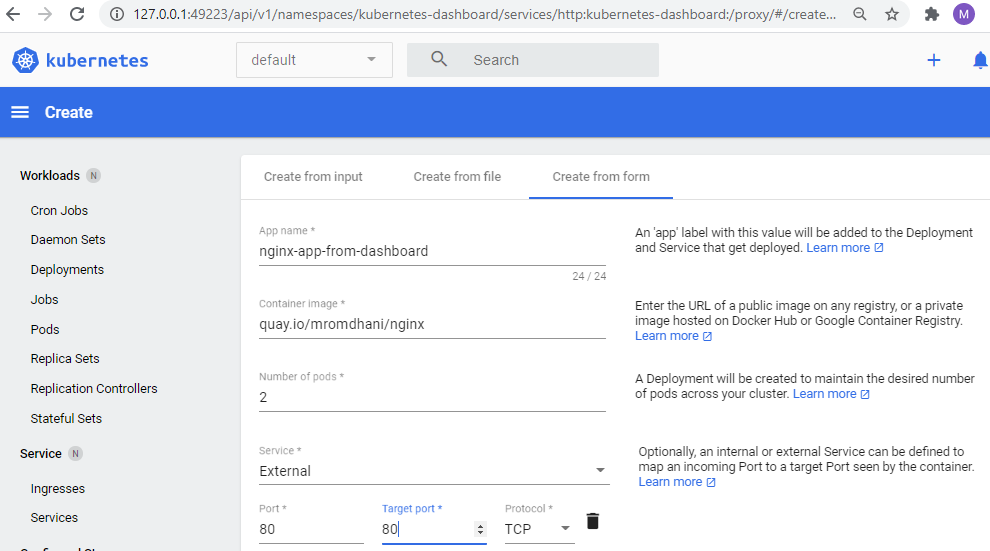
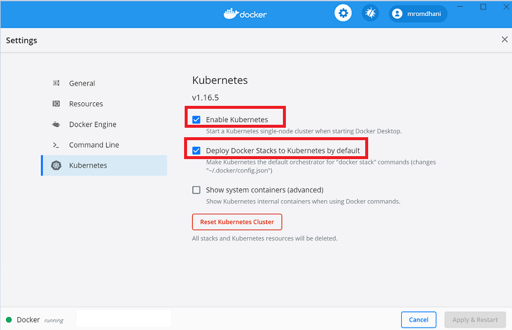

# Lab 01- Review of Kubernetes Basic Concepts
---

## Lab Steps:
- [Step 1 - Getting Started with Kubernetes](#step-1---getting-started-with-kubernetes)
- [Step 2 - Explore the Clusters of your Lab Environment](#step-2---explore-the-clusters-of-your-lab-environment)
- [Step 3 - Deploy and Expose your first Application](#step-3---deploy-and-expose-your-first-application)
    - [Create a Deployment](#create-a-deployment)
    - [Create a Service](#create-a-service)
    - [Scale the application](#scale-the-application)
    - [Clean Up](#clean-up)
- [Step 4 - Enable the Minikube Dashboard Web UI](#step-4---enable-the-minikube-dashboard-web-ui)
    - [Enabling Dashboard](#enabling-dashboard)
    - [Deploying applications using the Dashboard](#deploying-applications-using-the-dashboard)
- [Step 5 - Mini Guide for the Kubectl command](#step-5---mini-guide-for-the-kubectl-command)
- [Annex 1- Cluster Installation Guides](#annex-1--cluster-installation-guides)
  - [1.1 -  Installing Kubernetes Using Docker Desktop for Windows](#11----installing-kubernetes-using-docker-desktop-for-windows)
  - [1.2 - Installing Kubernetes Using Minikube](#12---installing-kubernetes-using-minikube)
    - [_Install Minikube_](#install-minikube)
    - [_Verify the installation of Minikube_](#verify-the-installation-of-minikube)
  - [1.3 - Building a multi-nodes cluster using VirtualBox and Vagrant](#13---building-a-multi-nodes-cluster-using-virtualbox-and-vagrant)
    - [Prerequisites](#prerequisites)
    - [Bringing Up The cluster](#bringing-up-the-cluster)
    - [Connect to the Cluster Master and check that it works](#connect-to-the-cluster-master-and-check-that-it-works)
    - [Useful Vagrant commands](#useful-vagrant-commands)
    - [Add the multi-node cluster to the list of cluster contexts](#add-the-multi-node-cluster-to-the-list-of-cluster-contexts)

# Step 1 - Getting Started with Kubernetes

- Using the following `kubectl` CLI command, display the version of your default cluster. You may use **Commander** terminal for these commands. Commander is an alternative for the standard Windows Command Line. With Commander, you can access multiple shells in one window using tabs. Each tab can contain Powershell, Git Bash, etc.   
```
$ kubectl version           # Gives the versions of the server and the client in a JSON format
$ kubectl version --short   # Gives just the version numbers
```

- Using the following `kubectl` CLI command, get the info about your default cluster.
```
$ kubectl cluster-info       
```

- Using the following `kubectl` CLI command, get the list of nodes about your default cluster.
```
$ kubectl get nodes       
```

- Using the following `kubectl` CLI command, get the list of namespaces about your default cluster.
```
$ kubectl get namespaces    # You can replace namespaces by its singular form namespace 
                              # or  simply by its shortcut ns      
```
- Using the following `kubectl` CLI command, get the list of deployed pods in the default namespace of your default cluster.
```
$ kubectl get pods         # You can replace pods by pod or simply by po      
```

- Using the following `kubectl` CLI command, get the list of deployed pods in the namespace `kube-system` of your default cluster. Identify the components of the Kubernetes control plan.
```
$ kubectl get pods --namespace kube-system    # You can replace --namespace by -n    
```

# Step 2 - Explore the Clusters of your Lab Environment

Three clusters are installed in your Lab Environement.
  - **Docker Desktop Kubernetes**. This cluster is a local single node cluster which comes by default with the Docker Desktop Community Edition. 
  - **Minikube Kubernetes**. This cluster in a local single node cluster which is developed and maintained by the Google's Kubernetes team. It supports multiple container runtimes and includes many addons to ease the its use.
  - **A remote Linux multi-nodes** (1 Master+ 2 Worker nodes) **Kubernetes**. This cluster is build from scratch using Linux Ubuntu VMs and Kubeadm installer and the Calico CNI Plugin. It is build using the Vagrant provisionning tool on the Oracle's VirtualBox hypervisor.

   Annex 1 of this Lab gives the details of the installation of these three clusters.

- Get the list of the configured cluster contexts and identify which one is the default one. Hint: there is an asterix sign (`*`) that marks the current cluster.
```
$ kubectl config get-contexts
```

- You can check the current context using the following command as well.
```
$ kubectl config current-context
```

- **Task** :  Switch to the context of the multi-nodes cluster and display the list of its nodes. Hint: This is the command to swith to a target context
```
$ kubectl config use-context <target-context> 
```
- Switch back the the minikube context using the collowing `kubectl` command. Most of the time, we will be using the Minikube Cluster.
```
 $ kubectl config use-context minikube 
```
- **Question:** Write down the path and the name of the configuation file which contains the list of cluster contexts: ..............................................  

# Step 3 - Deploy and Expose your first Application

### Create a Deployment

- Be sure to be in the minikubeb context and use the `kubectl create` command to create a Deployment object. The Pod runs a Container based on the provided Docker image.
```shell
$ kubectl create deployment nginx-app --image=quay.io/mromdhani/nginx
```

- View the Deployments, the replicasets, and the pods:
```shell
$ kubectl get deployments     # deploy is the shortname for deployments
$ kubectl get replicasets     # rs is the shortname for replicasets
$ kubectl get pods            # po is the shortname for pods
```

- **Task:** Experiment the options `-o wide`, `-o yaml` for the previous commands.

- Experiment the **self healing** feature of Kubernetes by trying to terminate the pod with the following command:
```shell
$ kubectl delete pods nginx-app-779db5df9f-227hk       # The pod name may be different in your case
pod "nginx-app-779db5df9f-227hk" deleted
 ```
Now try again to see the list of pods. If you're fast enough, you should see something like this:
```shell
$ kubectl get pods
NAME                        READY   STATUS              RESTARTS   AGE
nginx-app-cfd4bd475-8mv2x   0/1     ContainerCreating   0          3s
```

 As you can see, Kubernetes is already creating a new pod. If we try again in a few seconds, we'll see our pod back in the Running status. Can you understand what just happened? The deployment has specified a desired state of a single instance of our webserver application always up & running. As soon as we have killed the pod, Kubernetes has realized that the desired state wasn't respected anymore and, as such, it has created a new one. Smart, isn't it?

### Create a Service
By default, the Pod is only accessible by its internal IP address within the Kubernetes cluster. To make the container accessible from outside the Kubernetes virtual network, we have to expose it using a Kubernetes Service.

- Let's launch, first, the Minikube Loadbalancer in order to access the service from outside the cluster. Note that all **Minikube commands should be launched from an administrative Powershell shell**.
```
$ minikube tunnel  # This command should be launched from an Administrator 
                     # Powershell shell like all the Minikube commands.
```

- Then, let's expose the deployment outside the cluster using a service of type LoadBalancer on the port 80 
```shell
$ kubectl expose deployment nginx-app --type=LoadBalancer --port=80
```

- View the Service we just created:
```shell
$ kubectl get services
```
The output is similar to:
```shell
NAME               TYPE           CLUSTER-IP      EXTERNAL-IP    PORT(S)          AGE
nginx-app          LoadBalancer   10.98.98.14     10.108.243.54  80:31099/TCP     1m
```
Since we have specified LoadBalancer as type, Kubernetes will automatically assign an external IP, other than an internal IP, to our application. Since Kubernetes is running on our own machine, the external IP will be the localhost. As such, we can open a browser and type <http://10.108.243.54:80> to see the landing page of the Nginx application displayed.

### Scale the application
What if we want to scale our application up? The nice part of Kubernetes is that, exactly like what happened when we have killed the pod, we don't have to manually take care of creating / deleting the pods. We just need to specify which is the new desired state, by updating the definition of the deployment. For example, 

- Let's say that now we want 5 instances of hello-kubernetes to be always up & running. We can use the following command:
```shell
$ kubectl scale deployments nginx-app --replicas=5
```

- Now let's see again the list of available pods:
```shell
$ kubectl get pods
```

### Clean Up
Remove the deployment and the service
```
$ kubectl delete deploy nginx-app
$ kubectl delete svc nginx-app
```

# Step 4 - Enable the Minikube Dashboard Web UI

The Dashboard is a web-based Kubernetes user interface. You can use it to:
  - deploy containerized applications to a Kubernetes cluster
  - troubleshoot your containerized application
  - manage the cluster resources
  - get an overview of applications running on your cluster
  - creating or modifying individual Kubernetes resources (such as Deployments, Jobs, DaemonSets, etc)

### Enabling Dashboard

- We can  enable dashboard functionality via a short command.
```
$ minikube addons enable dashboard
```

- To view the dashboard, use the command:
```
$ minikube dashboard 
```

- Note that the dashboard may also be accessed via host machines if minikube resides on a Virtual Machine (Some SSH forwarding plumbling needed). Thus, `--url` parameter is added to retrieve the access URL instead.
```shell
$ minikube dashboard --url
```
We can access the dashboard once we point our web browser to the url listed above.


The 3 green circles give a quick overview of overall cluster health with respect to Deployments, Pods and Replicasets. 

### Deploying applications using the Dashboard

Dashboard lets you create and deploy a containerized application as a Deployment and optional Service with a simple wizard. You can  manually specify application details, or upload a YAML or JSON file containing application configuration, or use the wizard.

Click the CREATE button ➕ in the upper right corner of any page to begin.

**Task** Deploying the Nginx app using the Dashboard in the Default namespace.
The deploy wizard expects that you provide the following information:

- **App name (mandatory)**: Name for your application. A label with the name will be added to the Deployment and Service, if any, that will be deployed.
- **Container image (mandatory)**: The URL of a public Docker container image on any registry, or a private image (commonly hosted on the Google Container Registry or Docker Hub). The container image specification must end with a colon.
- **Number of pods (mandatory)**: The target number of Pods you want your application to be deployed in. The value must be a positive integer.
- **Service (optional)**: For some parts of your application (e.g. frontends) you may want to expose a Service onto an external, maybe public IP address outside of your cluster (external Service).



# Step 5 - Mini Guide for the Kubectl command

- Kubectl autocomplete
```bash
# Theese configurations are valid for a bash shell
$ source <(kubectl completion bash) # setup autocomplete in bash into the current shell, bash-completion package should be installed first.
$ echo "source <(kubectl completion bash)" >> ~/.bashrc # add autocomplete permanently to your bash shell.
```
You can also use a shorthand alias for kubectl that also works with completion:
```bash
$ alias k=kubectl
$ complete -F __start_kubectl k
```

- **Kubectl : Creating objects**

  |Commands   |      Effects      |  
  |----------|-------------|
  | `run` | Create a new Deployment object to run Containers in one or more Pods | 
  |`expose` |   Create a new Service object to load balance traffic across Pods   |  
  | `autoscale` | Create a new Autoscaler object to automatically horizontally scale a controller, such as a Deployment |    

- **Kubectl : Update operations**

  |Commands   |      Effects      |  
  |----------|-------------|
  | `scale` | Horizontally scale a controller to add or remove Pods by updating the replica count of the controller | 
  |`annotate` |   Add or remove an annotation from an object   |  
  | `label` | Add or remove a label from an object |
  | `set <field>` | Set an aspect of an object |  

- **Kubectl : Live Object Updates**

  |Commands   |      Effects      |  
  |----------|-------------|
  | `edit` | Directly edit the raw configuration of a live object by opening its configuration in an editor | 
  |`patch` |   Directly modify specific fields of a live object by using a patch string   |  

- **Kubectl : Deleting objects**

  |Commands   |      Effects      |  
  |----------|-------------|
  | `delete <type>/<name>` | Delete an object from a cluster | 

- **Kubectl : Viewing objects**

  |Commands   |      Effects      |  
  |----------|-------------|
  | `get` | Prints basic information about matching objects | 
  |`describe` |   Prints aggregated detailed information about matching objects  |  
  |`logs` |  Prints the stdout and stderr for a container running in a Pod  |  


# Annex 1- Cluster Installation Guides

## 1.1 -  Installing Kubernetes Using Docker Desktop for Windows

Since a while, Docker Desktop also comes with built-in support for Kubernetes, meaning that you don't have to install anything special to spin a Kubernetes cluster on your machine.
Once Docker Desktop is up & running, just right click on the icon in the systray and choose **Settings**. You will see a new section called **Kubernetes**. 

 
 
Check the **Enable Kubernetes option**. Docker Desktop will start the process to setup Kubernetes on your machine. This takes few minutes. After the operation is completed, you should see in the lower left corner the message Kubernetes is running marked by a green dot. To make things easier for later, make sure to check also the option **Deploy Docker Stacks to Kubernetes by default**.

Docker Desktop for Windows installs a single node cluster along with the CLI tool **kubectl**.


## 1.2 - Installing Kubernetes Using Minikube

Minikube provides a local single-node Kubernetes cluster inside a Virtual Machine (VM) on your laptop/desktop.
The installation instructions for each operation system is provided <https://kubernetes.io/docs/tasks/tools/install-minikube/>. The kubectl CLI tool is not integrated in Minikube, thus you should install it seperately.  

### _Install Minikube_ 
Minikube requires an Hypervisor. If you have already installed Docker Desktop for Windows, **Hyper-V** should be activated already. Othewise, follow these instructions to activate on your Windows (https://msdn.microsoft.com/en-us/virtualization/hyperv_on_windows/quick_start/walkthrough_install). It is possible to use another hypervisor such as [VirtualBox](https://www.virtualbox.org/wiki/Downloads).

* **Install Minikube using Chocolatey**
The easiest way to install Minikube on Windows is using [Chocolatey](https://chocolatey.org/) (run as an administrator):

    ```shell
    $ choco install minikube
    ```
  After Minikube has finished installing, close the current CLI session and restart a new shell nession. Minikube should have been added to your path automatically.

### _Verify the installation of Minikube_ 
To confirm successful installation of both a hypervisor and Minikube, you can run the following command to start up a local Kubernetes cluster. This command should be run as administrator.

```shell
$ minikube start --vm-driver=hyperv --memory=4000  # You are supposed to use hyperv hypervisor
<driver_name> can be virtualbox, docker, kvm2, vmware, ... 
```

Once minikube start finishes, run the command below to check the status of the cluster:

```shell
$ minikube status
```
If your cluster is running, the output from minikube status should be similar to:

```shell
host: Running
kubelet: Running
apiserver: Running
kubeconfig: Configured
```
After you have confirmed whether Minikube is working with your chosen hypervisor, you can continue to use Minikube or you can stop your cluster. To stop your cluster, run:

```shell
$ minikube stop
```
If you you need to clear minikube's local state:

```shell
$ minikube delete
```
Now you have two local clustors available on your laptop/desktop : the Docker Desktop Kubernetes Cluster and Minikube. You can list all the clusters using the following command:

```shell
$ kubectl config get-contexts
CURRENT   NAME                 CLUSTER          AUTHINFO         NAMESPACE
*         docker-desktop       docker-desktop   docker-desktop
          minikube             minikube         minikube
```

To switch from a cluster to another you can do it either using the Docker System Tray.

 

Or using the kubectl CLI.

```shell
$ kubectl config use-context docker-desktop
```

## 1.3 - Building a multi-nodes cluster using VirtualBox and Vagrant

This construction of the vluster is based on a `Vagrantfile` for the provisioning of 3 nodes Kubernetes cluster (1 master and 2 worker nodes) using `VirtualBox` and `Ubuntu 16.04`.

### Prerequisites

You need the following installed to use this playground.

- `Vagrant`, version 2.2 or better.
- `VirtualBox`, tested with Version 6.0
- Internet access, this playground pulls Vagrant boxes from the Internet as well as installs Ubuntu application packages from the Internet.

### Bringing Up The cluster

To bring up the cluster, a Vagrantfile is included in the folder `infra-multi-nodes-cluster`. Copy this folder under your Workspace folder. CD into the folder `C:\Workspace-Training-Kubernetes\infra-multi-nodes-cluster`. Open an administrator Powershell console,  and run the command `vagrant up` !

```bash
$ cd infra-multi-nodes-cluster
$ vagrant up
```

Vagrant will start three machines. Each machine will have a NAT-ed network
interface, through which it can access the Internet, and a `private-network`
interface in the subnet 192.168.205.0/24. The private network is used for
intra-cluster communication.

The machines created are:

| NAME | IP ADDRESS | ROLE |
| --- | --- | --- |
| k8s-master | `192.168.205.10` | Cluster Master |
| k8s-node-1 | `192.168.205.11` | Cluster Worker |
| k8s-node-2 | `192.168.205.12` | Cluster Worker |

As the cluster brought up the cluster master (**k8s-master**) will perform a `kubeadm init` and the cluster workers will perform a `kubeadmin join`.

### Connect to the Cluster Master and check that it works

This can be done either using :
- (i) the vagrant command 
```
$ vagrant ssh k8s-master   # Launch this command from within the folder where 
                             # the Vagrantfile exists; the SSH keys are stored in that folder.
```

- (ii) through the VS Code Remote SSH extension. for this, you have have to add the VM SSH keys to the VS Code Remote SSH extension :
  - Getting the VM SSH Keys. Launch the following command and copy its output (SSH Keys) to the clipboard.  
```
$ vagrant ssh-config 
```
  -  Add the SSH keys to VS Code.  From VS Code -> Menu View -> Command Palette -> Remote-SSH Open Config file, choose .ssh,and paste the SSH Keys from the Clipboard.

  - Connect to the cluster using VS Code. From VS Code ->Menu View -> Comand Palette -> Remote-SSH Connect to Host, choose k8s-master.

  - Check that the cluster works :
```
  kubectl cluster-info
  kubectl get nodes
```  

### Useful Vagrant commands

```bash
#Create the cluster or start the cluster after a host reboot
vagrant up

#Get the SSH Keys for the Vagrant Boxes
vagrant ssh-config

#Open an ssh connection to the Kubernetes master
vagrant ssh k8s-master

#Open an ssh connection to the Kubernetes node 1
vagrant ssh k8s-node-1

#Open an ssh connection to the Kubernetes node 2
vagrant ssh k8s-node-2

#Stop all Vagrant machines (use vagrant up to start)
vagrant halt

#Destroy the cluster
vagrant destroy -f
```

### Add the multi-node cluster to the list of cluster contexts

If you run the following config command on Windows, you will  see only the Docker Desktop and the Minikube clusters.
```
kubectl config get-contexts
```
These are the steps to add the the multi-node cluster to the list of cluster contexts. It is highly recommanded to take a copy of the original configuration files before changing them.

- Copy the content of the Kube config file of the Linux cluster (located in `~/.kube/config`) and save it to your windows host in a file named `C:\users\student\.kube\linuxclusterconfig` 

- Merge the two config files in a new file called for example merged_config (in Powsershell)
```
$    $Env:KUBECONFIG="$HOME\.kube\config;$HOME\.kube\linuxclusterconfig"    
$    kubectl config view --flatten > merged_config                     
```

- Override the existing config with the merged one. 
```
$    cp .\merged_config .\config
```

- Check that the new cluster has been successfully added to the list configured contexts.
Using the command `kubectl config`, switch between the three clusters.
```
$   kubectl config get-contexts
```

