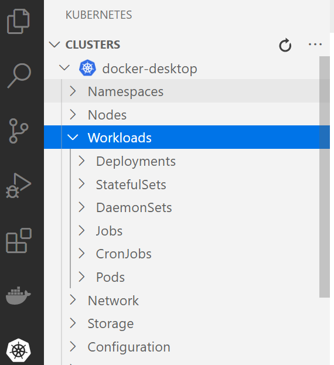
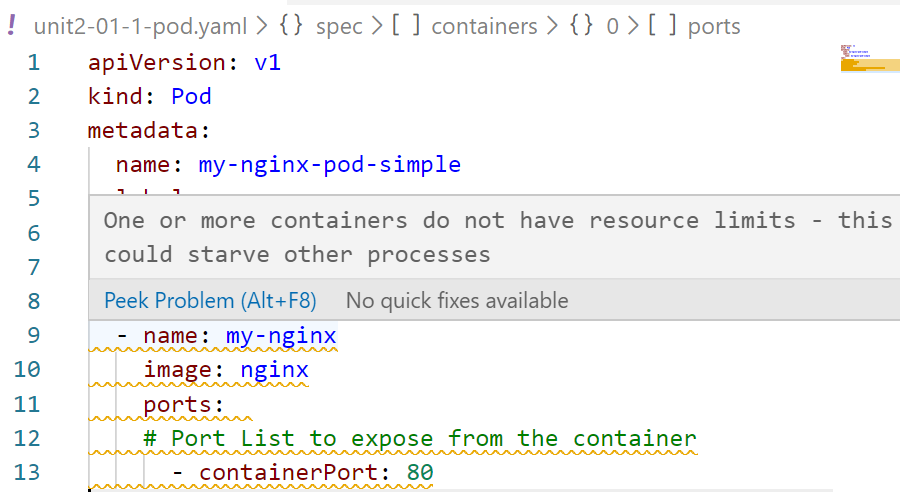

# Lab 02- Deploying applications
---

### Lab Steps

- [Step 1 - Building and Shipping a Custom Docker Image](#step-1---building-and-shipping-a-custom-docker-image)
- [Step 2 - Deploying the Spring Boot Application using Kubectl](#step-2---deploying-the-spring-boot-application-using-kubectl)
- [Step 3 - Getting started with YAML deployment](#step-3---getting-started-with-yaml-deployment)
  - [2.1- Editing Yaml Manifests with VS Code](#21--editing-yaml-manifests-with-vs-code)
  - [2.2 - Deploying Pods using YAML](#22---deploying-pods-using-yaml)
  - [2.3 - Deploying a Pod having a Side Car Container](#23---deploying-a-pod-having-a-side-car-container)
  - [2.4 - Working with Deployments](#24---working-with-deployments)
  - [2.5 - Deploying the Spring Boot Application using YAML](#25---deploying-the-spring-boot-application-using-yaml)
- [Step 3 - Implementing services using Yaml manifests](#step-3---implementing-services-using-yaml-manifests)
  - [3.1 Labels and Selectors](#31-labels-and-selectors)
  - [3.2 - ClusterIP Services](#32---clusterip-services)
  - [3.3- Nodeport Services](#33--nodeport-services)
  - [3.4 - LoadBalancer Services](#34---loadbalancer-services)
  - [3.5 - Exposing the Spring Application using Yaml manifest](#35---exposing-the-spring-application-using-yaml-manifest)
- [Step 4 - Deploying Daemon Sets](#step-4---deploying-daemon-sets)
- [Step 5- Deploying Jobs](#step-5--deploying-jobs)
- [Step 6- Deploying CronJobs](#step-6--deploying-cronjobs)

# Step 1 - Building and Shipping a Custom Docker Image 

The goal of this task is to build a custom docker image and to ship it to an image regsitry. 

Review the content of the Spring Boot projet provided in this lab folder. It is a simple microservice that exposes a REST Endpoint. This project contains a `Dockerfile` with the following content. Notice that this file specifies a multi-stage build process. 

```shell
# Build Stage for Spring boot application image
FROM adoptopenjdk/openjdk11:jdk-11.0.6_10-alpine-slim as build

LABEL maintainer="m.romdhani@businesstraining.be"

WORKDIR /workspace/app

COPY mvnw .
COPY .mvn .mvn
COPY pom.xml .
COPY src src

RUN ./mvnw package -DskipTests
RUN mkdir -p target/dependency && (cd target/dependency; jar -xf ../*.jar)

# Production Stage for Spring boot application image
FROM adoptopenjdk/openjdk11:jre-11.0.6_10-alpine
VOLUME /tmp
ARG DEPENDENCY=/workspace/app/target/dependency

# Copy the dependency application file from build stage artifact
COPY --from=build ${DEPENDENCY}/BOOT-INF/lib /app/lib
COPY --from=build ${DEPENDENCY}/META-INF /app/META-INF
COPY --from=build ${DEPENDENCY}/BOOT-INF/classes /app

CMD java -cp app:app/lib/* be.businesstraining.BookstoreBackendApplication
```

**Tasks:**  

- Using the `docker build` command, build an image for the Spring Boot project.

  Indications: Shell in Spring Boot Project folder and lauch the following command:
```
$  docker build -t bookstore-backend:v0 .
```
- Explore the docker image layers using the **dive** tool. dive is already installed on your machine
 ```
$  dive bookstore-backend:v0
``` 
   **Question**: Which application layer is the heaviest one -in size- ?  

- Using the  `docker run` command, start a container for the image.
```
$  docker run --name=mybookstore -p 8080:8080 bookstore-backend:v0 
```

- Test the container by sending some HTTP request. You can use either `curl` command or the `REST Client` extension of VS Code.   
```shell
GET http://localhost:8080/books HTTP/1.1
GET http://localhost:8080/books/2 HTTP/1.1
```

- Stop and Remove the container.
```
$  docker stop  mybookstore 
$  docker rm  mybookstore
```

- Ship the image to `DockerHub.com`. You can alternatively use another registry like `quay.io`, you follow the same procedure. You have to have an account on DockerHub.com. You have to create a repository on DockerHub for your images. See the details here :<https://docs.docker.com/docker-hub/repos/>
    - Log into the Docker Hub from the command line using the `docker login`  command.
    - Tag the image in a way that you include your username as a prefix for image name `<hub-user>/<repo-name>[:<tag>]`. Use the command `docker tag` for this. The following example tags the image in order to ship it to the `quay.io/mromdhani` repository.
```
$ docker tag  bookstore-backend:v0  quay.io/mromdhani/bookstore-backend:v0
```    
    - Push the image using the command `docker push`. 
```
$ docker push quay.io/mromdhani/bookstore-backend:v0
```
  
# Step 2 - Deploying the Spring Boot Application using Kubectl

This is a reminder of the two kubectl commands we have used in the previous lab in order to deploy the nginx image.

```shell
$ kubectl create deployment nginx-app --image=quay.io/mromdhani/nginx
$ kubectl expose deployment nginx-app --type=LoadBalancer --port=80
```

Using a similar approach, deploy the spring boot application, expose it and test it. You have to use the image for the spring boot application.
This is, alternatively, an image that you can use for the activivity `quay.io/mromdhani/bookstore-backend:v0`

# Step 3 - Getting started with YAML deployment

## 2.1- Editing Yaml Manifests with VS Code

For fully integrated Kubernetes experience within VS Code, you can install the [Kubernetes Tools extension](https://marketplace.visualstudio.com/items?itemName=ms-kubernetes-tools.vscode-kubernetes-tools), which lets you quickly develop Kubernetes manifests and browse and manage your Kubernetes clusters.  This extension has already been installed in your VS Code.


The Kubernetes extension provides autocompletion, code snippets, and verification for the Kubernetes manifest file. For example, once you type 'Deployment', a manifest file with fundamental structure is autogenerated for you. You only need to enter your app name, image, and port manually.

The Kubernetes extension can help you check the status of your application. From the Explorer, click on Workloads, right click on Pods and then choose Get to see whether the application has started. 



To view the status of your app, select Services, right click on your app, and then click Get. The status will be printed to the Integrated Terminal.

## 2.2 - Deploying Pods using YAML
A Pod is a group of one or more containers with shared storage/network, and a specification for how to run the containers.

- Start VS Code and create a Pod using a YAML file
```shell
code unit2-01-pod.yaml  # Use code to launch VS Code from the command line 
```
Enter the following content.
```yaml
apiVersion: v1
kind: Pod
metadata:
  name: my-nginx-pod-simple
  labels:
    name: my-nginx-pod-simple
spec:
  containers:
  - name: my-nginx
    image: quay.io/mromdhani/nginx
    ports:  
    # Port List to expose from the container    
      - containerPort: 80
```
   > **Note** : Not specifying a port for a container **DOES NOT** prevent that port from being exposed. It is exactly same with Dockerfile EXPOSE instruction !

  In the VS Code editor, you may see yellow under lines within the Yaml `containers` section (cf. the following picture). If you hover over those lines, you will see this message : `One or more containers do not have resource limits ...`

  This message is send by the Kubernetes Linter which is activated by default by the Kubernetes Extension.
  
  
  To fix this warning, either you should either add the specification of resources limits or disable the linter. The right solution would be adding resource limits specification , but for sake of simplicity let's disable the Kubernetes Linter.
   - From VS Code **File** Menu, Select **Preferences**, then **Settings**. 
   - Type `Kubernetes` in the Search bar. When **Vs-Kubernetes** is found, click on the **Edit in settings.json** hyper link. **settings.json** will be opened in the editor.
   -  Locate the  `"vs-kubernetes"` key and add `"disable-linters": ["resource-limits"]` within it.
    ```json
   "vs-kubernetes": {  
       "disable-linters": ["resource-limits"],  // This is the line to Add.
        ...  
    ```
   -  Restart VS Code and you'll notice that the warning has disappered.

- Create the Pod using `kubectl create` command. `kubectl apply`would work also but the `apply` command is intended to update existing resources. It creates the resource if the resource doesn't exist.
  ```shell
    $ kubectl create -f unit2-01-pod.yaml   
  ```
  - View the status of the Pod.
   ```shell
    $ kubectl get pods -o wide
   ```
- Add a Namespace and a Label to the Pod within the `metada` section of the Pod Yaml manifest.
  ```yaml
      metadata:
        name: my-nginx-pod
        namespace: default
        labels:
          name: my-nginx-pod 
          profile: dev
  ```
  - Apply the new configuration using `kubectl apply` command. 
  - Check that the new label has been added to the Pod configuration. Hint:  Use `kubectl describe pod my-nginx-pod` or ` kubectl get pod my-nginx-pod --show-labels`.
  - Test the Pod. Implement a simple port forwarding in order to access to the pod. 
```shell
  $ kubectl port-forward my-nginx-pod 8080:80
```   
  - Curl the Pod or connect to it using your web browser. The URL to connected to is http://localhost:8080 
```shell
  $ curl.exe http://localhost:8080
``` 
  - Clean Up. Stop the port-forwading by issuing a `CTRL-C` from within its terminal. Delete the Pod using the following command.
```shell
  $ kubectl delete pod my-nginx-pod
``` 

## 2.3 - Deploying a Pod having a Side Car Container

  In the previous example, we have deployed a single container Pod. While this is likely the most common way to deploy pods, there are several situations where a pod will package more that one container. Sidecar containers is a pattern where the so-called sidecar container is there to "help" the main container. Some examples include log or data change watchers, monitoring adapters, and so on. This ensures some kind of seperation of concerns. 
  
  There are several other patterns for multi-container pods like Proxies and Adapters. For example, Apache HTTP server or nginx can act as a reverse proxy to a web application in the main container to log and limit HTTP requests.
  After completing this task , you will be able to create Pod having two containers: a main container and a side-car container.
  
 - Edit a new YAML file and name it `unit2-02-pod-with-sidecar.yaml`. Initialize it with the following content :
    ```yaml
    apiVersion: v1
    kind: Pod
    metadata:
      name: pod-with-sidecar
    spec:
      # Create a volume called 'shared-logs' that the app and sidecar share
      volumes: 
      - name: shared-logs
        emptyDir: {}
      containers:
      # Main application container
      - name: app-container
        image: alpine
        volumeMounts:
        - name: shared-logs
          mountPath: /html
        command: ["/bin/sh", "-c"]
        args:
          - while true; do
              echo "$(date) <br/>" >> /html/index.html;
              sleep 2;
            done
      # Sidecar container
      - name: sidecar-container
        image: nginx
        volumeMounts:
        - name: shared-logs
          mountPath: /usr/share/nginx/html
    ```
    
- Create the Pod using the following command
```shell
  kubectl create -f unit2-02-pod-with-sidecar.yaml
```
  - Check that the pod has been created: Use ` kubectl get pods pod-with-sidecar`. Check that the Pod contains two containers : Use `kubectl describe pod-with-sidecar` command.  
- Test the Pod. Implement a simple port forwarding in order to access to the pod. 
```shell
  kubectl port-forward pod-with-sidecar 8080:80
```   
  - Curl the Pod or connect to it using your web browser. The URL to connected to is http://localhost:8080 
```shell
  curl.exe http://localhost:8080
``` 
- Clean Up. Stop the port-forwading by issuing a `CTRL-C` from within its terminal. Delete the Pod using the `kubectl delete pod pod-with-sidecar` command.

## 2.4 - Working with Deployments

A Deployment resource uses a ReplicaSet to manage the pods. However, it handles updating them in a controlled way. 
- Create a Deployment by editing a new YAML file. Name it `unit2-03-deployment.yaml`. Initialize it with the following content :
```yaml
apiVersion: apps/v1
kind: Deployment
metadata:
  name: nginx-app-deploy
  labels:
    app: nginx-app-deploy
spec:
  replicas: 3
  selector:
    matchLabels:
      app: nginx
  template:
    metadata:
      labels:
        app: nginx
    spec:
      containers:
        - name: nginx-container
          image: quay.io/mromdhani/nginx
```
- Create the Deployment using  the following command :
```shell
$  kubectl create -f unit2-03-deployment.yaml
```  
  - Check that the deployment has been created: Use the `kubectl get deployments` command. 
  - Check that the ReplicaSet and the 3 pods are been created: Use the `kubectl get rs` command.
  - Check that the 3 pods have been created: Use the `kubectl get pods` commands.  
- Test the deployment. Expose a simple service in order to load balance the requests to the pods. 
```shell
$  kubectl expose deployment nginx-app-deploy --type=LoadBalancer --port=9089 --target-port=80
```   
  - Connect to the application using your web browser. The URL to connected to is http://localhost:9089. You will see the nginx welcome page.

- Scaling a Deployment
  - Change the replicas attribute in the Yaml manifest `unit2-03-deployment.yaml`  and set its value to `5` and save the file.
  ```yaml
  replicas: 5   # 5 replaces the old value (3)
  ```
  - Apply the update of the deployment using the following command:
  ```
  kubectl apply -f unit2-03-deployment.yaml --record
  ```
  - Verify that there are 5 replicas of the nginx Pod. For this, use the `kubectl get pods` command. 

- Updating a Deployment

   - Let's update the image of the Deployment. Change the image attribute in the Yaml  manifest `unit2-03-deployment.yaml` and set its value to `quay.io/mromdhani/nginx:1.15` and save the file.
    ```
      image: quay.io/mromdhani/nginx:1.15
    ```
   - Apply the update of the deployment using the following command:
   ```
   kubectl apply -f unit2-03-deployment.yaml --record
   ```
   - Verify that the image has been updated.
    ```shell
    kubectl describe deploy nginx-app-deploy | findstr Image
    ```
   - You can alternatively update the image using the interactive command `kubectl edit deployment` or `kubectl set image`. Let's update the image back to the latest version using `kubectl set image` :
```
$ kubectl set image deployment nginx-app-deploy nginx-app-deploy=quay.io/mromdhani/nginx 
```
   - Verify that the image has been updated.
    ```shell
    kubectl describe deploy nginx-app-deploy | findstr Image
    ```

- Clean Up 

 Delete the Deployment the deployment using the command :
```
$ kubectl delete -f  unit2-03-deployment.yaml  # You can add the options 
                                                  # --grace-period=0 --force
```

## 2.5 - Deploying the Spring Boot Application using YAML

Write a deployment manifest (YAML) named `bookstore-deployment.yaml` for the  Spring boot application. Use the image you have build and pushed to your Cloud repository or alternatively the image `quay.io/mromdhani/bookstore-backend:v0`. 
  - Indication: The solution is provided in the folder `bookstore-backend-data-in-memory\K8s`.


# Step 3 - Implementing services using Yaml manifests

## 3.1 Labels and Selectors
In this step, you will be able to use labels and selectors when addressing Pods.
Let's go through a Deployment and a Service.
- Create the following Yaml file defining a Deployment and a Service for MySQL application. Name The file `unit2-04-labels-and-selectors.yaml`.
  ```yaml
  apiVersion: apps/v1
  kind: Deployment
  metadata:
    name: mysql
  spec:
    replicas: 2
    selector:
      matchLabels:
        app: mysql
        tier: db
    template:
      metadata:
        labels:
          app: mysql
          tier: db
      spec:
        containers:
        - image: quay.io/mromdhani/mysql:5.6
          name: mysql
          env:          
          - name: MYSQL_ROOT_PASSWORD # Use secret in real usage
            value: password
          ports:
          - containerPort: 3306
            name: mysql
  ---
  apiVersion: v1
  kind: Service
  metadata:
    name: mysql
  spec:
    selector:
      app: mysql
      tier: db
    ports:
    - port: 3306

  ```
In the Deployment specification, we defined the following labels in the ReplicaSet section for the deployment.
```yaml
 matchLabels:
        app: mysql
        tier: db 
```
In the Service specification, we defined the following selector for Pods.
```yaml
 selector:
    app: mysql
    tier: db
```
The defined selector expression matches the label definitions within the Pod template.  This way the service will balance the traffic for the pods. Let's verify that the Service manages access for the Pods.
- Apply the Yaml file using the following command.
```shell
  kubectl apply -f unit2-04-labels-and-selectors.yaml
```
- View the Endpoints managed by the service. You will see two endpoints, each one is dedicated to MySQL Pod.
```shell
  kubectl get ep mysql 
  NAME       ENDPOINTS                      AGE
  my-nginx   10.1.1.93:3306,10.1.1.94:3306  1m       
```
- Let's comment out the `tier: db` label from the Replicaset definition (Line `10`) and from the Pod template (Line `15`) in the deployment specification and apply the Yaml file again. You shoudl remove the deployment completely and re-apply it because we have touched its selector ! 
```shell
  kubectl delete -f unit2-04-labels-and-selectors.yaml
  kubectl apply -f unit2-04-labels-and-selectors.yaml
```
- View the Endpoints managed by the service. You will see no endpoints due to the missmatching between the labels and selector expression.
```shell
  kubectl describe  svc mysql | findstr Endpoints
  Endpoints:         <none>  
```
- Clean up. Remove the deployment and the service.
```shell
  kubectl delete -f unit2-04-labels-and-selectors.yaml
```

## 3.2 - ClusterIP Services

The ClusterIP is the default service type. Kubernetes will assign an internal IP address to your service. This IP address is reachable only from inside the cluster. You can - optionally - set this IP in the service definition file. Think of the case when you have a DNS record that you don't want to change and you want the name to resolve to the same IP address. You can do this by defining the clusterIP part of the service definition as follows:
```shell
kubectl cluster-info dump | findstr service-cluster-ip-range
       --service-cluster-ip-range=10.96.0.0/12
```
- Let's continue with the Yaml used in the previous Step. The service was of type ClusterIP since this is the default service which assigned by Kubernetes API Server whenever you don't specify any type.
Here is a copy of the same Yaml renamed `unit3-02-services-cluster-ip.yaml`. The service type has been added explicity just for better lisibility.
Create the `unit2-05-services-cluster-ip.yaml` file and initialize it as follows.
  ```yaml
  apiVersion: apps/v1
  kind: Deployment
  metadata:
    name: mysql-local
  spec:
    replicas: 2
    selector:
      matchLabels:
        app: mysql-local
        tier: db  
    template:
      metadata:
        labels:
          app: mysql-local
          tier: db  
      spec:
        containers:
        - image: quay.io/mromdhani/mysql:5.6
          name: mysql
          env:          
          - name: MYSQL_ROOT_PASSWORD # Use secret in real usage
            value: password
          ports:
          - containerPort: 3306
            name: mysql
  ---
  apiVersion: v1
  kind: Service
  metadata:
    name: mysql
  spec:
    selector:
      app: mysql-local
      tier: db
    type: ClusterIP   # this is the default type
    ports:
    - port: 3306
  ```
- Apply the Yaml file using the following command.
```shell
  kubectl apply -f unit2-05-services-cluster-ip.yaml
```
- View the Endpoints managed by the service. You will see two endpoints, each one is dedicated to MySQL Pod.
```shell
  kubectl get ep mysql 
  NAME       ENDPOINTS                      AGE
  my-nginx   10.1.1.97:3306,10.1.1.98:3306   1m       
```
- View the hostnames and the IPs of the replica Pods:
```shell
kubectl get pods -o wide
NAME                     READY   STATUS    RESTARTS   AGE     IP           NODE             NOMINATED NODE   READINESS GATES
mysql-8474c4447c-d2pww   1/1     Running   0          35m     10.1.1.97    docker-desktop   <none>           <none>
mysql-8474c4447c-qzlqx   1/1     Running   0          35m     10.1.1.98    docker-desktop   <none>           <none>
```
- The question now how to access the MySQL Pods (`mysql-8474c4447c-d2pww:10.1.1.97` , `mysql-8474c4447c-qzlqx:10.1.1.98`) ? CluserIP does not enable the access from the outside of the cluster. We should get into the cluster to access the the Pods. 

 An easy solution, is to spin up a new Pod within the cluster. This Pod will run a MySQL Client image in order to connect to one of the MySQL Pods. Run the following command to implement this solution.

  ```
  kubectl run -it --rm --image=quay.io/mromdhani/mysql:5.6 --restart=Never mysql-client -- mysql -h mysql -uroot -ppassword 
  If you don't see the prompot press Enter.
  mysql>
  ```
  From within the mysql> prompt run the following commands to verify the running hostname and the remote client.
  ```
  mysql> show variables where Variable_name='hostname';
  +---------------+------------------------+
  | Variable_name | Value                  |
  +---------------+------------------------+
  | hostname      | mysql-8474c4447c-d2pww |
  +---------------+------------------------+
  1 row in set (0.01 sec)
  ```
  To display the IP of the Client which is the new pod, run the following command:
  ```shell
  mysql> select host from information_schema.processlist;
  +-----------------+
  | host            |
  +-----------------+
  | 10.1.1.99:36196 |
  +-----------------+
  1 row in set (0.00 sec)
```
  > NOTE: ClusterIP loadbalances the requests between all the Pods[[ref](https://kubernetes.io/docs/concepts/services-networking/service/#defining-a-service)]. In order to get a correct database behaviour, We should share the data between the two pods. A correct solution should make use of a shared Persistent Volume between the two pods. We will see this solution in the next Lab.  
- Clean Up. Remove the application and the service 
```shell
  kubectl delete -f unit2-05-services-cluster-ip.yaml
```

## 3.3- Nodeport Services

The NodePort services makes the Pods accessible on a static port on each Node in the cluster. This means that the service can handle requests that originate from outside the cluster.

You can use the IP address of any node, the service will receive the request and route it to one of the pods. Manually allocating a port to the service is optional. If left undefined, Kubernetes will automatically assign one. It must be in the range of `30000-32767`. If you are going to choose it, ensure that the port was not already used by another service. Otherwise, Kubernetes will report that the API transaction has failed.

Notice that you must always anticipate the event of a node going down and its IP address becomes no longer reachable. The best practice here is to place a load balancer above your nodes.

- Apply the Yaml file using the following command.
```shell
  kubectl apply -f unit2-06-services-nodeport.yaml
```
This is the content of `unit2-06-services-nodeport.yaml`
```yaml
  apiVersion: apps/v1
  kind: Deployment
  metadata:
    name: app-nodeport
  spec:
    selector:
      matchLabels:
        run: demo-nodeport
    replicas: 3
    template:
      metadata:
        labels:
          run: demo-nodeport
      spec:
        containers:
        - name: dockercloud
          image: quay.io/mromdhani/nginx
          ports:
          - containerPort: 80
  ---
  apiVersion: v1
  kind: Service
  metadata:
    name: svc-nodeport
  spec:
    # Exposes the service on a static port on each node
    # so that we can access the service from outside the cluster 
    type: NodePort
    # When the node receives a request on the static port (30166) "select pods with
    #  the label 'run' set to 'dockercloud-nodeport'" and forward the request to one of them
    selector:
      run: demo-nodeport
    ports:
    - nodePort: 30166   # A static port assigned to each node for external access
      port: 8080        # Port  exposed internally in the cluster
      targetPort: 80    # port that containers are listening to
      protocol: TCP
```
- View the Endpoints managed by the service. You will see two endpoints, each one is dedicated to CodeCloud Pod.
```shell
  kubectl get ep svc-nodeport 
  NAME       ENDPOINTS                      AGE
  svc-nodeport   10.1.1.106:80,10.1.1.107:80,10.1.1.108:80   2m56s     
```
- View the description of the service:
```shell
  kubectl get svc svc-nodeport 
  NAME           TYPE       CLUSTER-IP     EXTERNAL-IP   PORT(S)          AGE
 svc-nodeport   NodePort   10.99.219.38   <none>        8080:30166/TCP   3m56s    
```
- Curl the application or browse it at `http://localhost:30166`. The Node address in the case of Docker Desktop for Windows is `localhost`  and the NodePort is `30166` which we have specified in the Yaml manifest. 
When using a web browser, refresh several times the URL and you will notice that the service load balances the requests to the 3 pods. 
- Clean Up. Remove the application and the service application  
```shell
  kubectl delete -f unit2-06-services-nodeport.yaml
```

## 3.4 - LoadBalancer Services

This service type works when you are using a cloud provider to host your Kubernetes cluster. When you choose LoadBalancer as the service type, the cluster will contact the cloud provider and create a load balancer. Traffic arriving at this load balancer will be forwarded to the backend pods. The specifics of this process is dependent on how each provider implements its load balancing technology. 

Docker Desktop for Windows creates an external load balancer which is able to automatically handle the workload in case we have multiple instances of our web application running.

- Apply the Yaml file using the following command.
```shell
  kubectl apply -f unit3-04-services-loadbalancer.yaml
```
This is the content of `unit2-07-services-loadbalancer.yaml`
  ```yaml
  apiVersion: apps/v1
  kind: Deployment
  metadata:
    name: app-loadbalancer
  spec:
    selector:
      matchLabels:
        run: dockercloud-lb
    replicas: 3
    template:
      metadata:
        labels:
          run: dockercloud-lb
      spec:
        containers:
        - name: dockercloud
          image: quay.io/mromdhani/nginx
          ports:
          - containerPort: 80
  ---
  apiVersion: v1
  kind: Service
  metadata:
    name: svc-loadbalancer
  spec:
    # Exposes the service using an external loadbalancer
    type: LoadBalancer
    # When the loadbalancer receives a request on the  port (8080) it forward the request to one 
    # of the pods on their port 80.
    selector:
      run: dockercloud-lb
    ports:
    - port: 8080        # Port exposed by the loadbalancer
      targetPort: 80    # port that containers are listening to
      protocol: TCP
  ```
- View the description of the service:
```shell
  kubectl get svc svc-loadbalancer 
  NAME               TYPE           CLUSTER-IP      EXTERNAL-IP   PORT(S)          AGE
 svc-loadbalancer   LoadBalancer   10.101.77.108   localhost     8080:30672/TCP   22s   
```
- Curl the application or browse it at `http://localhost:8080`. The external IP  is `localhost`  and the loadbalancer port is `8080` which we have specified in the Yaml manifest. 
When using a web browser, refresh several times the URL and you will notice that the service load balances the requests to the 3 pods. 
- Clean Up. Remove the application and the service application  
```shell
  kubectl delete -f unit2-07-services-loadbalancer.yaml
```

## 3.5 - Exposing the Spring Application using Yaml manifest

Choose the right type of the service and write the Yaml manifest for exposing the Spring boot application `bookstore-backend-data-in-memory`.
 - Indication: The solution is provided in folder `bookstore-backend-data-in-memory\K8s`

# Step 4 - Deploying Daemon Sets

DaemonSets are used to ensure that some or all of your Kubernetes nodes run a copy of a pod, which allows you to run a daemon on every node. When you add a new node to the cluster, a pod gets added to match the nodes. Similarly, when you remove a node from your cluster, the pod is put into the trash. Deleting a DaemonSet cleans up the pods that it previously created.

DaemonSets behave very similarly to a Kubernetes deployment, with the exception that they will be automatically distributed to ensure the pods are deployed on each node in the cluster. 

A common use for DaemonSets would be for logging. Perhaps we need to ensure that our log collection service is deployed on each node in our cluster to collect the logs from that particular node. 

- For this example, we'll deploy a simple container as a DaemonSet to show that they are distributed on each node. While this example, is just deploying a basic container, it could be deploying critical services like a log collector. 

  Edit the manifest below in a file named `unit2-08-daemonset.yaml`.
  ```yaml
  apiVersion: apps/v1
  kind: DaemonSet
  metadata:
    name: daemonset-example
    labels:
      app: daemonset-example
  spec:
    selector:
      matchLabels:
        app: daemonset-example
    template:
      metadata:
        labels:
          app: daemonset-example
      spec:
        containers:
        - name: busybox
          image: busybox
          args:
          - sleep
          - "10000"
  ```
- Apply the manifest with the:
```shell
kubectl apply -f unit2-08-daemonset.yaml --record
```
After we apply it, lets take a look at the results by running:
```shell
kubectl get pods --selector=app=daemonset-example -o wide
```
 - Clean Up. Delete the daemon set deployment. 
    ```    
    kubectl delete daemonset daemonset-example
    ```

# Step 5- Deploying Jobs

Kubernetes Jobs ensure that one or more pods execute their commands and exit successfully. When all the pods have exited without errors, the Job gets completed. When the Job gets deleted, any created pods get deleted as well.

For example, we may have a queue of messages that needs processing. We must spawn consumer jobs that pull messages from the queue until it’s empty. To implement this pattern in Kubernetes Jobs, we set the .spec.completions parameter to a number (must be a non-zero, positive number). The Job starts spawning pods up till the completions number. The Job regards itself as complete when all the pods terminate with a successful exit code. 

Edit the manifest below in a file named `unit2-09-job.yaml`.
```yaml
apiVersion: batch/v1
kind: Job
metadata:
  name: consumer
spec:
  completions: 5
  template:
    metadata:
      name: consumer
    spec:
      containers:
      - name: consumer
        image: gcr.io/google-containers/busybox
        command: ["/bin/sh","-c"]
        args: ["echo 'consuming a message'; sleep 5"]
      restartPolicy: OnFailure
```

- Apply the manifest with the:
```shell
kubectl apply -f unit2-09-job.yaml --record
```
After we apply it, lets take a look at the results by running:
```shell
kubectl get pods --watch
```
The output shows that the Job has created the first pod. When the pod terminated without failure, the Job spawned the next one all long till the last of the ten pods were created and terminated with no failure.

Another pattern may involve the need to run multiple jobs, but instead of running them one after another, we need to run several of them in parallel. Parallel processing decreases the overall execution time. It has its application in many domains, like data science and AI. We can specify the paralellism degree using the field `spec.parallelism`.
```yaml
spec:
  parallelism: 5
```
 - **Task:** Update the job manifest by setting the parallelism to 5 and reducting the completion to 1. Watch the result.
 - Clean Up. Delete the job deployment. 
    ```    
    kubectl delete job consumer
    ```

# Step 6- Deploying CronJobs

You can use a CronJob to run Jobs on a time-based schedule. These automated jobs run like Cron tasks on a Linux or UNIX system.

Cron jobs are useful for creating periodic and recurring tasks, like running backups or sending emails. Cron jobs can also schedule individual tasks for a specific time, such as if you want to schedule a job for a low activity period. Note that CronJobs was promoted to general availability in Kubernetes v1.21. Older Kubernetes versions do not support the batch/v1 CronJob API.

Edit the manifest below in a file named `unit2-10-cronjob.yaml`. This example cron job config `.spec` file prints the current time and a hello message every minute:
```yaml
apiVersion: batch/v1
kind: CronJob
metadata:
  name: simple-cronjob
spec:
  schedule: "*/1 * * * *"
  jobTemplate:
    spec:
      template:
        spec:
          containers:
          - name: simple-cronjob
            image: gcr.io/google-containers/busybox
            imagePullPolicy: IfNotPresent
            command:
            - /bin/sh
            - -c
            - date; echo Hello from the Kubernetes cluster
          restartPolicy: OnFailure
```

- Apply the manifest with the:
```shell
kubectl apply -f unit2-10-cronjob.yaml --record
```
After we apply it, lets take a look at the results by running:
```shell
kubectl get cronjob hello
NAME             SCHEDULE      SUSPEND   ACTIVE   LAST SCHEDULE   AGE
simple-cronjob   */1 * * * *   False     0        <none>          10s
```
As you can see from the results of the command, the cron job has not scheduled or run any jobs yet. Watch for the job to be created in around one minute:
```shell
kubectl get jobs --watch
NAME                       COMPLETIONS   DURATION   AGE
simple-cronjob-4111706356   0/1                      0s
simple-cronjob-4111706356   0/1           0s         0s
simple-cronjob-4111706356   1/1           5s         5s
```

- Clean Up. Delete the cron job. 
    ```    
    kubectl delete cronjob simple-cronjob
    ```
